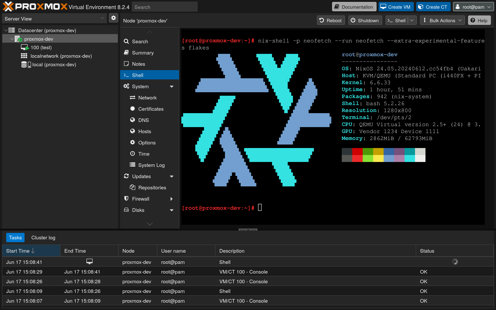

# Proxmox on NixOS



This project is a port of the [Proxmox Hypervisor](https://www.proxmox.com/) on NixOS.

⚠️ Proxmox-NixOS is still **experimental** and we do not advise running it on production machines. Do it at your own risk and only if you are ready to fix issues by yourself.

## 🚀 Quick start

### With [`npins`](https://github.com/andir/npins)

Add `proxmox-nixos` as a dependency of your npins project.

```console
$ npins add github SaumonNet proxmox-nixos -b main
[INFO ] Adding 'proxmox-nixos' …
    repository: https://github.com/SaumonNet/proxmox-nixos.git
    branch: main
    revision: ...
    url: https://github.com/saumonnet/proxmox-nixos/archive/$revision.tar.gz
    hash: ...
```

Below is a fragment of a NixOS configuration that enables Proxmox VE.

```nix
# file: configuration.nix
{ pkgs, lib, ... }:
let
    sources = import ./npins;
    proxmox-nixos = import sources.proxmox-nixos;
in
{
  imports = [ proxmox-nixos.nixosModules.proxmox-ve ];
  services.proxmox-ve.enable = true;
  nixpkgs.overlays = [
    proxmox-nixos.overlays.x86_64-linux
  ];
  # The rest of your configuration...
}
```

### With Flakes

Below is a fragment of a NixOS configuration that enables Proxmox VE.

```nix
{
  description = "A flake with Proxmox VE enabled";

  inputs = {
    nixpkgs.url = "github:NixOS/nixpkgs/nixos-unstable";
    proxmox-nixos.url = "github:SaumonNet/proxmox-nixos";
  };

  outputs = { self, nixpkgs, proxmox-nixos, ...}: {
    nixosConfigurations = {
      yourHost = nixpkgs.lib.nixosSystem rec {
        system = "x86_64-linux";
        modules = [

          proxmox-nixos.nixosModules.proxmox-ve

          ({ pkgs, lib, ... }: {
            services.proxmox-ve.enable = true;
            nixpkgs.overlays = [
              proxmox-nixos.overlays.${system}
            ];

            # The rest of your configuration...
          })
        ];
      };
    };
  };
}
```

## 🌐 Networking

To get internet in your VMs, you need to add a network device to the VM, connected to a bridge. To get this working, follow this 2 steps:
1) Create the bridge in `System->Network->Create->Linux Bridge`. This operation has no effect on your system and is just a quirk for Proxmox to know the existence of your bridge.
2) Configure your networking through NixOS configuration so that the bridge you created in the Proxmox web interface actually exists!

### Example NixOS networking configurations

Any kind of advanced networking configuration is possible through the usual NixOS options, but here are basic examples that can get you started:

#### With `systemd-networkd`

```nix
    systemd.network.networks."10-lan" = {
        matchConfig.Name = [ "ens18" ];
        networkConfig = {
        Bridge = "vmbr0";
        };
    };

    systemd.network.netdevs."vmbr0" = {
        netdevConfig = {
            Name = "vmbr0";
            Kind = "bridge";
        };
    };

    systemd.network.networks."10-lan-bridge" = {
        matchConfig.Name = "vmbr0";
        networkConfig = {
            IPv6AcceptRA = true;
            DHCP = "ipv4";
        };
        linkConfig.RequiredForOnline = "routable";
    };
```

### With scripted networking

```nix
    networking.bridges.vmbr0.interfaces = [ "ens18" ];
    networking.interfaces.vmbr0.useDHCP = lib.mkDefault true;
```

